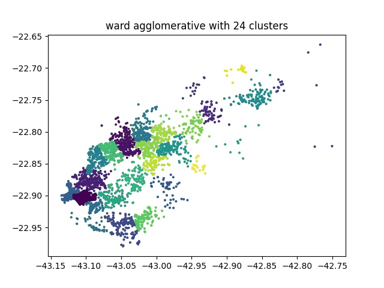
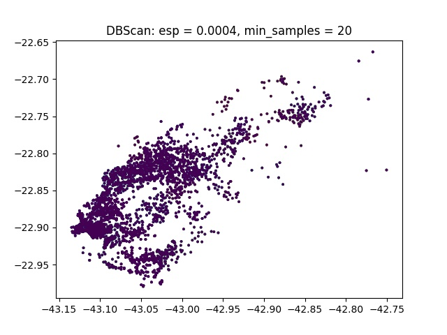

# loggi-osrm research:

# Inside data/

A sample from [loggibud](http://github.com/loggi/loggibud/)'s data

# Clustering

Since the data is too big to be handled in a single go, I decided to break the problem into smaller clusters that can be stored in memory, thus reducing the number of HTML requests made.

I'm no specialist in data mining, so I did some test runs in sklearn and ran the following clustering algorithms

     

DBScan is poorly optimized, but I tried plenty of parameters, and even the best one didn't manage to cluster the with minimum quality.

# Inside src/

Still the first attempt. Did not work because the OSRM docker crashes after a fixed number of requests. Decided to fix it by clustering points into regions, but I should try to run the OSRM C API too, later.

## cpp files:

- bad-opframe-main.cpp has all the necessary pieces from optframe, but the variables aren't properly isolated. Should be used as a template for further improvement.

- curlpp-example.cpp is reference I use to remember how to use curlpp and osrm http requests

- main-loggi.cpp was used to test the different algorithms

- optframe-main.cpp is used to call optframe and actually try to optimize the problem.

## hpp files:

- FCore_functions.hpp have the functions that will be used in [OptFrame](http://github.com/optframe/optframe/)'s FCore. _Needs a refactor!_

- loggi-context-loader.hpp has all the main class definitions regarding the problem itself.

- loggi-evaluator.hpp has functions that call OSRM to evalute distances

- loggi-include.hpp calls necessary functions and every other hpp in the correct order.

- loggi-solution-generators.hpp has the initial solutions. Currently a dumb one that generates on the giver order of the .json file and another that was based on the puca interpretation of the Clarke-Wright algorithm

- MoveData.hpp has the template that will be used to specify the Move's position

- NSSeq2Opt.hpp id the first Move implemented, currently being used to test if the integration is running smoothly.